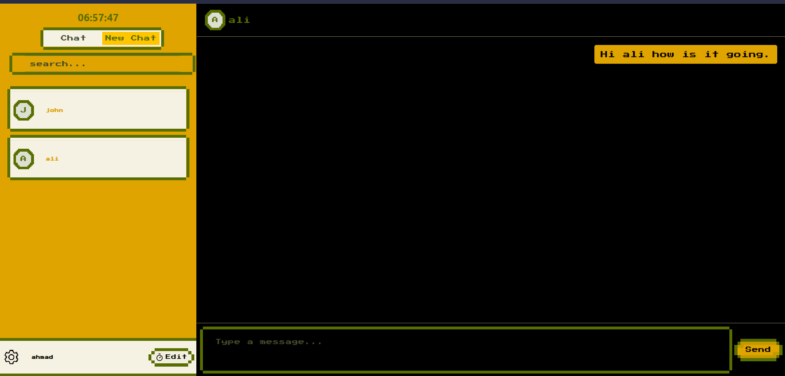

# Teer: The Cool Chatapp!

<p align="center">
  <a href="https://hackclub.com" target="_blank">
    
  </a>
  <a href="https://teer-chat.vercel.app//" target="_blank">
    
  </a>
</p>




## Description

Well, this is a chatapp we all know and it have all functionality that a basic chat app should have like 
[x] we can communicate in real time
[x] our messages are saved(but we keep only for 7 hours)
[x] sell your data and you get span emails. jk we don't even ask you to enter you mail `+ point`
[x] both light and dark mode. but we have tons of it 

## How to use 
Go [here](https://teer-chat.vercel.app/) and register yourself. then you know what to do

## How can I Contribute
First you need to have [git](https://git-scm.com/) if don't know what is git then you should skip this portion. its not for you
- ### First Step 
clone repo
```bash
git clone https://github.com/ahmadsiddique-dev/teer
```
- ### Second Step
change directory to teer
```bash
cd teer
```
- ### Third 
now you have two folder one is 
  - Frontend
  - Backend 
## For frontend 
```bash
cd client
```
#### install dependencies
```bash
npm i 
```
### Run Server
```bash
npm run dev
```
## For Backend
```bash
cd server
```
#### install dependencies
```bash
npm i 
```
### Run Server
```bash
npm run start:dev
```

Now go to http://localhost:5173 and pray for me!
